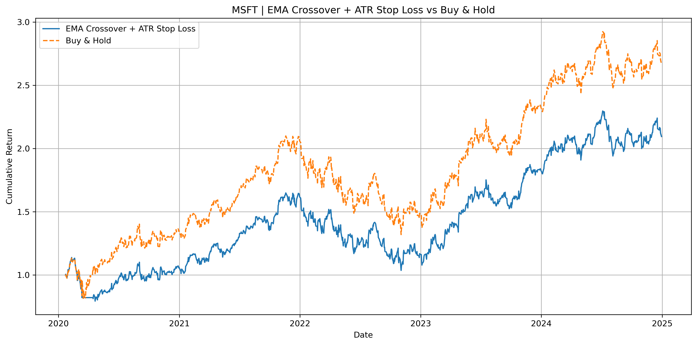

# Strategy Comparison

A quick comparison of basic trend-following strategies using moving averages and ATR-based stop-losses. Focused on simplicity and visual clarity.
(Backtested on MSFT, BTC, EUR/USD, SPY, Gold from 2020–2024)

## Strategies

- **Basic EMA crossover**: 10/50
- **Triple EMA crossover**: 10/50/200
- **Basic EMA + ATR stop-loss**: 10/50 with 1.5× ATR
- **Triple EMA + ATR stop-loss**: 10/50/200 with 1.5× ATR
- **Buy & Hold**: benchmark

## Test

- Default: `MSFT` (2020–2024)
- Easily switch to `BTC-USD`, `EURUSD=X`, etc.

## Project Layout

- `Strategies/` – Strategy notebooks
- `Outputs/` – Exported results
- `Images/` – Plots

## How to Use

Run any notebook in Jupyter. Each one downloads its own data via `yfinance`, performs the backtest, and saves results automatically.

To test a different asset, just change the `ticker` variable at the top of `00_run_all_strategies.ipynb`.

## Comparisons and Results by Asset

### MSFT (2020–2024)

  
  
  

For MSFT, all strategies held up decently over the 2020–2024 period.  
The basic EMA (10/50) captured most of the trend and performed well overall.  
The triple EMA (10/50/200) added some smoothing, it filtered out noise but entered trades later.  
ATR-based stop-losses helped with drawdowns but often kicked out of trades too early, especially in normal pullbacks.  

In the end, plain EMA or triple EMA without SL gave the best results, depending on how much risk you're willing to accept.

---

The following assets show **bar chart comparisons** across strategies (Sharpe, volatility, drawdown, etc).

### BTC-USD (2020–2024)

Basic EMA crossover (no SL) outperformed others, as it stayed in during long uptrends. SL-based strategies exited prematurely in high volatility.

### EUR/USD (2020–2024)

All strategies underperformed. Range-bound behavior and volatility made it difficult for trend-following to work. SL helped reduce drawdowns.

### SPY (2020–2024)

Strong bullish behavior allowed most strategies to do well. Triple EMA with SL balanced drawdown and Sharpe ratio. Buy & Hold had highest return but higher volatility.

### GOLD (2020–2024)

Mixed performance. Basic EMA captured some moves, but frequent whipsaws hurt all strategies. SL strategies limited risk but often exited sideways chop.

## Conclusion

The experiments show that no single strategy consistently outperforms across assets:

In strong uptrends like BTC, MSFT or SPY, simple EMA crossovers outperformed, just staying in the market paid off.  
In choppier assets like EURUSD or GOLD, the stop-loss versions helped reduce damage, but also missed rebounds.

Triple EMA helped smooth entries/exits, but sometimes reacted too slowly.  
Adding ATR-based exits lowered drawdowns, but at the cost of cutting winners early.

Ultimately, results depend heavily on market behavior.

## Notes

- All results are generated with daily close data.
- You can customize ATR window, EMA lengths, or stop-loss factor.
- The idea is to isolate the impact of volatility-aware exits on otherwise simple strategies.
